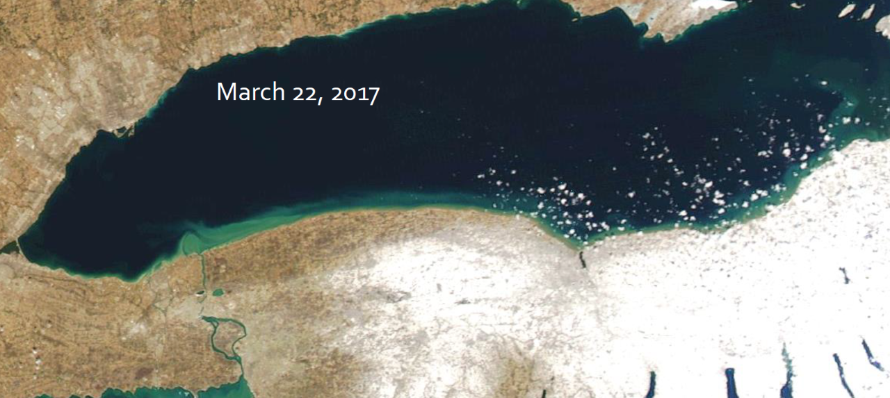
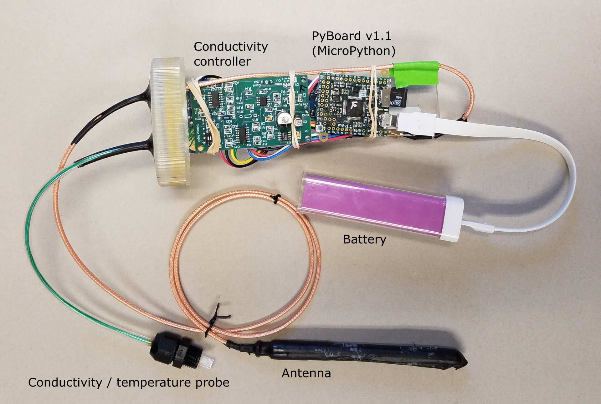

# Data, modeling, visualization, and sensors <!-- .tags: pf -->

Terry Brown, Post doc.
Brown.TerryN@epa.gov

## Themes <!-- .tags: pf -->

 - Processing / management of large datasets from 
   sensors and simulations
 - Visualization of large, complex datasets  
 - Getting from data to understanding for resource managers

# SNNM <!-- .tags: pf -->

Simple Nearshore Nutrient Model

James Pauer and Tom Hollenhorst

Modeling nutrient movement in the nearshore as a
precursor to Harmful Algal Blooms (HABs).

## Visualization <!-- .tags: pf -->

 - Web based, *potentially* better for
   collaboration.
 - Complex patterns more easily observed.

<video height="500" controls data-autoplay>
    <source data-src="./vid/0001-0609.mkv"
    type="video/mp4" />
</video>

# Modeling transfer from outfalls to intakes in the Great Lakes

 - Work for Office of Water, currently rule making
   for bromide release from coal fired power plants.
 - Bromide - commonly found in steam
   electric plant effluent - is a trihalomethane
   precursor.
 - Chemicals in this family are thought to be
   carcinogens.

## Nearshore flow

 - There is a nearshore flow or "stream" in the
   Great Lakes that retains inputs.
 - Mixing with the full lake volume is delayed.
 - Contaminants entering the Great Lakes linger in
   the shallower nearshore.
   - Dilution is more limited.
   - The nearshore is where people interact with
     the lakes.

## Nearshore flow <!-- .slide: data-state="hide-head" -->

## Agent based modeling <!-- .tags: pf -->

 - Able to represent details of complex systems.
 - Captures emergent behavior / features.
 - Works well with a distributed computing
   approach.

## EPA High End Scientific Computing (HESC)

 - 128 nodes (computers) each with 256 Gb RAM and
   32 cores.
 - Large memory node, 1.5 Tb RAM.
 - 4 GPU nodes
 - 1.4 Pb, or 1,400 Tb drive
 - EMVL group provides support, but quite open to
   direct use.

## Grid cells <!-- .slide: data-state="hide-head" -->
<!-- .tags: pf -->
<video height="600" controls data-autoplay>
    <source data-src="./vid/noaacells.mkv"
    type="video/mp4" />
</video>

## LM animation <!-- .slide: data-state="hide-head" -->
<!-- .tags: pf -->

<video height="700" controls data-autoplay>
    <source data-src="./vid/0001-1000.mkv"
    type="video/mp4" />
</video>

# Drifters
<!-- .slide: data-state="img-left" -->
<!-- .tags: pf -->

 <!-- .element: height="500" -->

Tom Hollenhorst and Jim Berrill

 - Map currents, conductivity, and temperature.
 - Low cost, deploy en masse.
 - Validate hydrodynamic models.
 - Measure at scales model data is unavailable.

## Drifters - components
<!-- .tags: pf -->

 <!-- .element: width="80%" -->

## Drifters - components
<!-- .tags: pf -->

 <!-- .element: width="80%" -->

## Software components
<!-- .tags: pf -->

 - Software on the drifters, in MicroPython, which
   collects and transmits data.
 - Software on the field laptop, tracking
   drifters.
 - Post-processing and visualisation software.
 - "DrifterOS" - software to download data and
   update software wirelessly.

## Visualization
<!-- .tags: pf -->

 - Web based
 - Observe complex patterns
 - Select representative parts of data
 - View relationships between drifters

## PP animation <!-- .slide: data-state="hide-head" -->
<!-- .tags: pf -->

<video height="700" controls data-autoplay>
    <source data-src="./vid/0001-1262.mkv" type="video/mp4" />
</video>

<!--
vim:tw=50
--->

# Themes <!-- .tags: pf -->

 - Processing / management of large datasets from 
   sensors and simulations
 - Visualization of large, complex datasets  
 - Getting from data to understanding for resource managers
