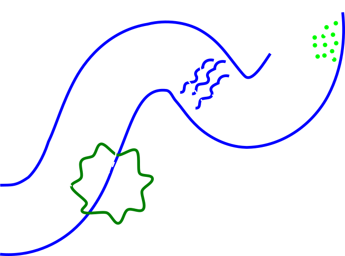
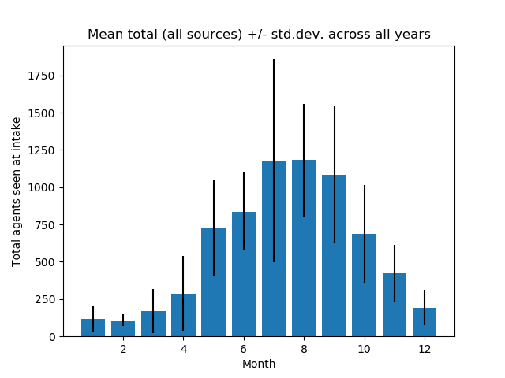
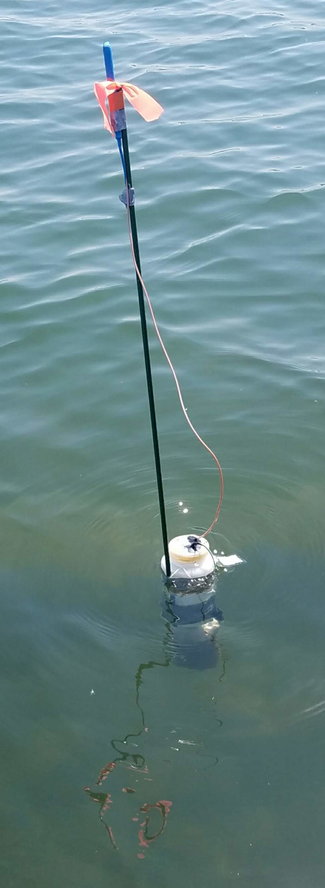
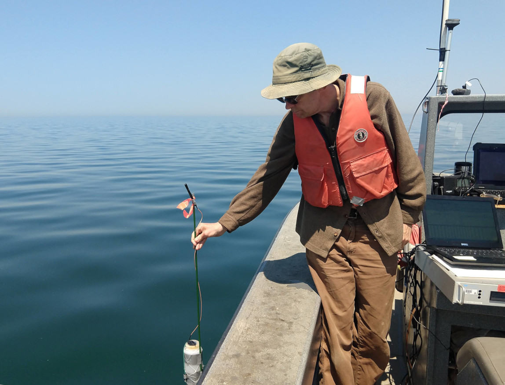

# Data and sensor development

Terry Brown, Post doc.
Brown.TerryN@epa.gov

## Themes

 - Processing / management of large datasets from 
   sensors and simulations
 - Visualization of complex datasets  
 - Getting from data to understanding for managers

# SNNM

Simple Nearshore Nutrient Model

## Simple == Open

 - Try to avoid calibration
 - Prefer direct use of real world observations
 - Minimize complexity

## Visualization

 - Web based
 - Observe complex patterns

# Glider

## Data pipeline

## Visualization

 - Web based
 - Observe complex patterns

## Application

 - Supplement satellite surface / shallow view
 - Sampling for 40-100+ days a year

# Data indexing / mining

Turning 20 years of data into a 20 year data set.

# Bromide OW

Using off the shelf current data from NOAA to
model flow between coal fired power stations and
drinking water intakes in the Great Lakes.

Work for Office of Water, currently rule making
for Br- release.

## Nation wide, minus the Great Lakes

 - OW had already done the analysis for rivers and
   streams, but not the Great Lakes.
 - Great Lakes other than Michigan are half
   Canadian, always a challenge data wise.
 - 30 million people live in the Great Lakes
   basin.   

## Previously, cell based modeling

 - Track fate of P entering the lakes, precursor
   to algal blooms.
 - Interactive web based visualization.   

## Agent based modeling

 - Able to represent details of complex systems
 - Captures emergent behavior / features
 - Requires distributed computing approach

## Agents

- exist at a specific point in space
- can have multiple static and varying attributes
- can interact with surrounding agents (and cells)
  based on distance etc.
- added and removed from the model over the
  model's run-time

## Agents as individuals

## Agent Based Models (ABMs) and complexity

- run ABM with thousands of agents...
- competition for food / shade
- big fish / little fish
  - how does time spent hiding impact time
    spent feeding?
- test different behaviors / foraging
  strategies

Complexity more easily represented in ABMs

## Agents for continuous phenomena

- historically agent based modeling focused on distinct
  entities (fish in streams, etc.)
- modern computational power allows large numbers of
  agents to approximate continuous phenomena
- often used to model plumes / spills

## EPA High End Scientific Computing

 - 128 nodes (computers) each with 256 Gb RAM and
   32 cores
 - Large memory node, 1.5 Tb RAM
 - 4 GPU nodes
 - 1.4 Pb, or 1,400 Tb drive

## Model structure, NOAA data

 - Run for 12 years, 2004-2015, analyze the last
   ten.
 - Br- very persistent, particles given a two year
 life-span.

## Seasonal variations

 <!-- .element: style="filter: invert(100%)" -->

## Seasonal variations

 <!-- .element: style="filter: invert(100%)" -->

## Animation

## Seasonal patterns / Improved model

 - Seasonal patterns in nearshore currents influence
   seasonal transfer rates
 - Office of Water originally using
    "people within 50 km of plant"
 - Seasonal effects influence exposure pathways
 

# Drifters
<!-- .slide: data-state="img-left" -->

 <!-- .element: height="500" -->

 - Map currents, conductivity, and temperature
 - Low cost, deploy en masse

## Drifters - components

 <!-- .element: width="80%" -->

## Drifters - components

 <!-- .element: width="80%" -->

## Low cost

 - unit cost < $250
   - cf. a Cyanoscope for $500+
 - Affordable for smaller communities 
 - Outreach opportunity for schools etc.
   - Have students assemble units
   - Deploy units from kayaks etc.

## Application
<!-- .slide: data-state="img-right" -->

 - Shallow environments, rivers
 - Detect tributary specific inputs
   - warm water from *that* outfall
   - road salt from *that* stream
 - Local site specificity gives managers actionable
   information

## Visualization

 - Web based
 - Observe complex patterns
 - Select representative parts of data
 - View relationships between drifters

## Internet of things

 - AES encrypted transmission
 - Units relay messages to increase range
 - Stream network monitoring

 <!-- .element width="80%" -->

<!--
vim:tw=50
-->
