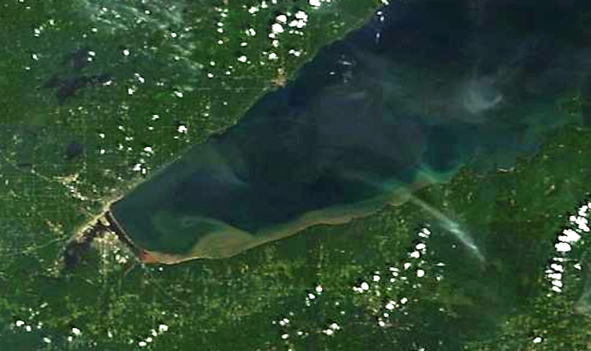
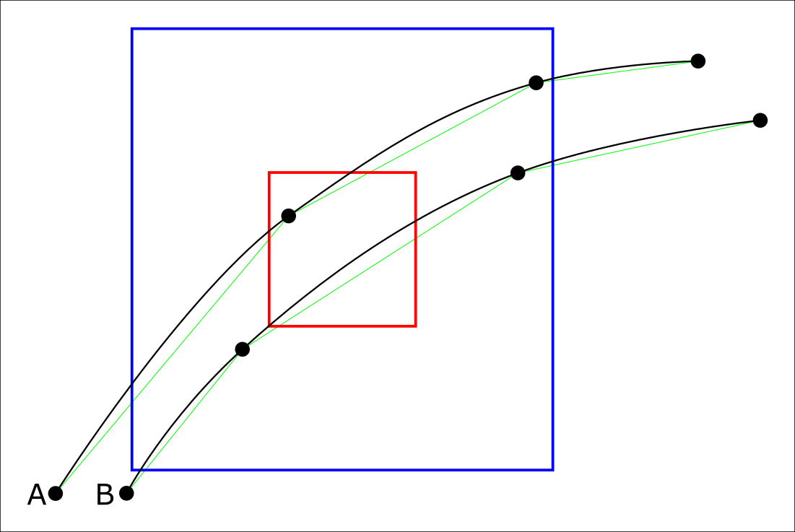
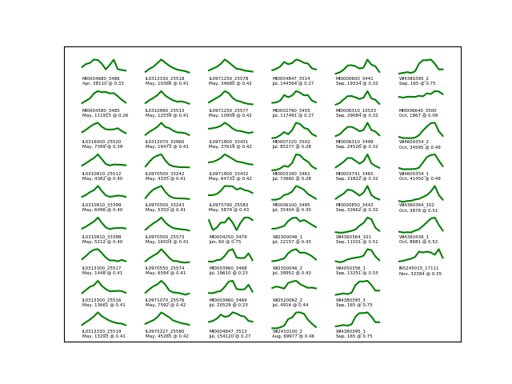

# Modeling transfer from outfalls to intakes in the Great Lakes

Terry Brown, Post doc.  
Brown.TerryN@epa.gov  
Mid-continent Ecology Division  
Watersheds and Water Resources Branch

## OW working on bromide from power stations

 - Work for Office of Water, currently rule making
   for bromide release from coal fired power plants.
 - Bromide - commonly found in steam
   electric plant effluent - is a trihalomethane
   precursor.
 - Chemicals in this family are thought to be
   carcinogens.

## Nation wide, minus the Great Lakes

 - OW had already done the analysis for rivers and
   streams, but not the Great Lakes.
 - Great Lakes other than Michigan are half
   Canadian, always a challenge data wise.
 - 30 million people live in the Great Lakes
   basin.

## Considerations

 - Our model is not predicting intake bromide concentration, but
   relative exposure, seasonality etc.
 - We used hydrodynamic model output from NOAA,
 who provide archived flow data for all five Great
 Lakes for the past 15 years.  
 - NOAA's currently
 available data is a generation behind, model
 wise, but its immediate availability made our
 work possible in the time available.

## Nearshore flow

 - There is a nearshore flow or "stream" in the
   Great Lakes that retains inputs.
 - Mixing with the full lake volume is delayed.
 - Contaminants entering the Great Lakes linger in
   the shallower nearshore.
   - Dilution is more limited.
   - The nearshore is where people interact with
     the lakes.

## Nearshore flow <!-- .slide: data-state="hide-head" -->

## Nearshore flow <!-- .slide: data-state="hide-head" -->

August 11 2012

## Previous grid based modeling

 - Track fate of P entering the lakes, precursor
   to algal blooms.
 - Interactive web based visualization.

## Previous work

<video height="500" controls>
    <source data-src="./vid/0001-0609.mkv"
    type="video/mp4" />
</video>

## Agent based modeling

 - Able to represent details of complex systems.
 - Captures emergent behavior / features.
 - Works well with a distributed computing
   approach.

## Agents

- Exist at a specific point in space.
- Can have multiple static and varying attributes.
- Can interact with surrounding agents (and
  grid cells) based on distance etc.
- Added and removed from the model over the
  model's run-time.

## Agents as individuals

## Agent Based Models (ABMs) and complexity

- Run ABM with thousands of agents...
- Competition for food / shade.
- Big fish / little fish
  - How does time spent hiding impact time
    spent feeding?
- Test different behaviors / foraging
  strategies.

Complexity more easily represented in ABMs.

## Agents for continuous phenomena

- Historically agent based modeling focused on distinct
  entities (fish in streams, etc.).
- Modern computational power allows large numbers of
  agents to approximate continuous phenomena.
- Often used to model plumes / spills.

## EPA High End Scientific Computing (HESC)

 - 128 nodes (computers) each with 256 Gb RAM and
   32 cores.
 - Large memory node, 1.5 Tb RAM.
 - 4 GPU nodes
 - 1.4 Pb, or 1,400 Tb drive
 - EMVL group provides support, but quite open to
   direct use.

## Model structure, grid data

 - Run for 12 years, 2004-2015, analyze the last
   ten.
 - Bromide very persistent, particles given a two year
   life-span.

## Grid cells <!-- .slide: data-state="hide-head" -->

<video height="600" controls>
    <source data-src="./vid/noaacells.mp4"
    type="video/mp4" />
</video>

## Intake

 <!-- .element: style="filter: invert(100%)" width="600" -->

9 billion modeled particle positions

## LM animation <!-- .slide: data-state="hide-head" -->

<video height="700" controls>
    <source data-src="./vid/outputMap.mp4"
    type="video/mp4" />
</video>

## Seasonal variations

 <!-- .element: style="filter: invert(100%)" -->

## Seasonal variations

 <!-- .element: style="filter: invert(100%)" -->

## Seasonal patterns / Improved model

 - Seasonal patterns in nearshore currents influence
   intake exposure levels.
 - Office of Water originally using
    "people within 50 km of plant".
 - Seasonal effects and temperature influence exposure pathways.
 - OW sees this as a basis for further work in the Great Lakes.
 

<!--
vim:tw=50
--->