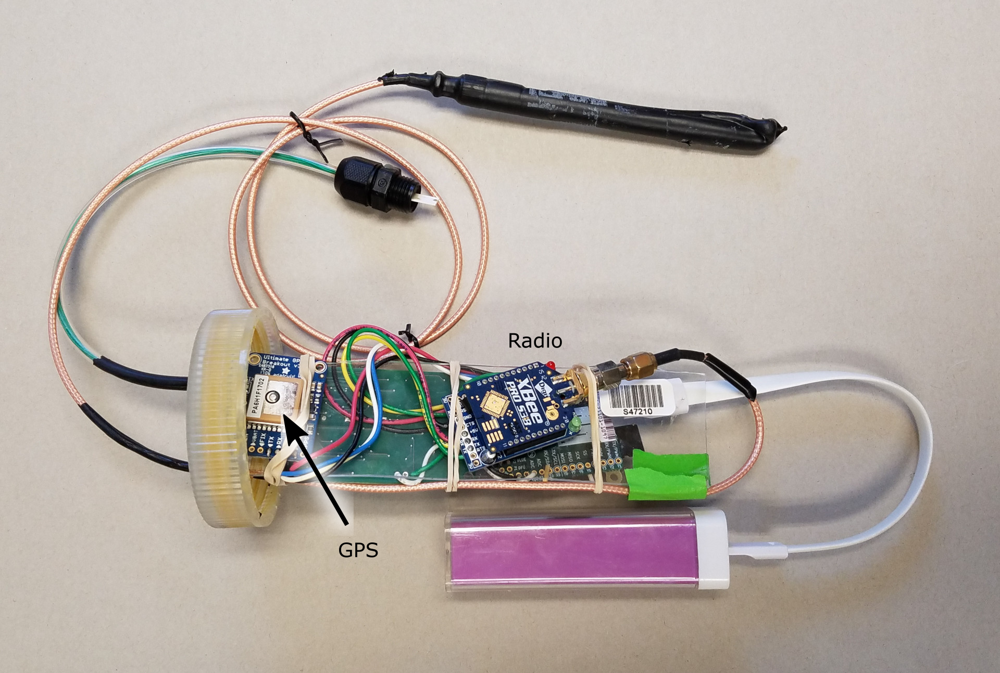

# Data, modeling, visualization, and sensors <!-- .tags: pf -->

Terry Brown, Post doc.
Brown.TerryN@epa.gov

## Themes <!-- .tags: pf -->

 - Processing / management of large datasets from 
   sensors and simulations
 - Visualization of large, complex datasets  
 - Getting from data to understanding for resource managers

# SNNM <!-- .tags: pf -->

Simple Nearshore Nutrient Model

James Pauer and Tom Hollenhorst

Modeling nutrient movement in the nearshore as a
precursor to Harmful Algal Blooms (HABs).

## Simple == Open <!-- .tags: pf -->

 - Try to avoid calibration
 - Some models have dozens of calibration
   variables and minimal observations.
 - Prefer direct use of real world observations
 - Minimize complexity

## Visualization <!-- .tags: pf -->

 - Web based, *potentially* better for
   collaboration.
 - Complex patterns more easily observed.

<video height="500" controls data-autoplay>
    <source data-src="./vid/0001-0609.mkv"
    type="video/mp4" />
</video>

# Data indexing / mining <!-- .tags: pf -->

Turning 20 years of data into a 20 year data set.

 - Data spider - search by file type, column
 names, dates, number of records, spatial
 footprint.
 - Data index, tags, and full text searching.

[Data inventory
interface](http://v2626umcth926.rtord.epa.gov/data_inventory/)

# OW working on bromide from power stations <!-- .tags: pf -->

 - Work for Office of Water, currently rule making
   for bromide release from coal fired power plants.
 - Bromide - commonly found in steam
   electric plant effluent - is a trihalomethane
   precursor.
 - Chemicals in this family are thought to be
   carcinogens.

## Agent based modeling <!-- .tags: pf -->

 - Able to represent details of complex systems.
 - Captures emergent behavior / features.
 - Works well with a distributed computing
   approach.

## Model structure, grid data <!-- .tags: pf -->

 - Run for 12 years, 2004-2015, analyze the last
   ten.
 - Bromide very persistent, particles given a two year
   life-span.

## Grid cells <!-- .slide: data-state="hide-head" -->
<!-- .tags: pf -->
<video height="600" controls data-autoplay>
    <source data-src="./vid/noaacells.mkv"
    type="video/mp4" />
</video>

## Intake
<!-- .tags: pf -->
 
 <!-- .element: style="filter: invert(100%)" width="600" -->

9 billion modeled particle positions

## LM animation <!-- .slide: data-state="hide-head" -->
<!-- .tags: pf -->

<video height="700" controls data-autoplay>
    <source data-src="./vid/0001-1000.mkv"
    type="video/mp4" />
</video>

## Seasonal variations
<!-- .tags: pf -->

 <!-- .element: style="filter: invert(100%)" -->

## Seasonal variations
<!-- .tags: pf -->

 <!-- .element: style="filter: invert(100%)" -->

## Seasonal patterns / Improved model
<!-- .tags: pf -->

 - Seasonal patterns in nearshore currents influence
   intake exposure levels.
 - Office of Water originally using
    "people within 50 km of plant".
 - Seasonal effects and temperature influence exposure pathways.
 - OW sees this as a basis for further work in the Great Lakes.
 

# Drifters
<!-- .slide: data-state="img-left" -->
<!-- .tags: pf -->

 <!-- .element: height="500" -->

Tom Hollenhorst and Jim Berrill

 - Map currents, conductivity, and temperature.
 - Low cost, deploy en masse.
 - Validate hydrodynamic models.
 - Measure at scales model data is unavailable.

## Drifters - components
<!-- .tags: pf -->

 <!-- .element: width="80%" -->

## Drifters - components
<!-- .tags: pf -->

 <!-- .element: width="80%" -->

## Low cost
<!-- .tags: pf -->

 - Unit cost < $250.
   - cf. a Cyanoscope for $500+
 - Affordable for smaller communities.
 - Outreach opportunity for schools etc.
   - Have students assemble units
   - Deploy units from kayaks etc.

## Software components
<!-- .tags: pf -->

 - Software on the drifters, in MicroPython, which
   collects and transmits data.
 - Software on the field laptop, tracking
   drifters.
 - Post-processing and visualisation software.
 - "DrifterOS" - software to download data and
   update software wirelessly.

## Internet of things
<!-- .tags: pf -->

 - AES encrypted transmission.
 - Units relay messages to increase range.
 - Stream network monitoring.

 <!-- .element width="80%" -->

## Visualization
<!-- .tags: pf -->

 - Web based
 - Observe complex patterns
 - Select representative parts of data
 - View relationships between drifters

## PP animation <!-- .slide: data-state="hide-head" -->
<!-- .tags: pf -->

<video height="700" controls data-autoplay>
    <source data-src="./vid/0001-1262.mkv" type="video/mp4" />
</video>

<!--
vim:tw=50
--->

# Themes <!-- .tags: pf -->

 - Processing / management of large datasets from 
   sensors and simulations
 - Visualization of large, complex datasets  
 - Getting from data to understanding for resource managers
